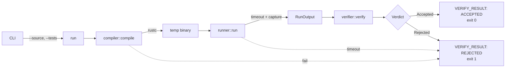

# verirust

Deterministic verifier for Rust code submissions. Compiles a source file,
runs it against expected output, and emits a machine-readable verdict.

Built for the RLVR (Reinforcement Learning with Verifiable Rewards) setting:
a verifier that accepts reasonable valid solutions and rejects everything else.

## Usage

```bash
verirust --source solution.rs --tests expected.txt
```

Optional: `--timeout <SECONDS>` (default 5).

## Verdict contract

| Condition | stdout | stderr | exit |
|---|---|---|---|
| Accepted | `VERIFY_RESULT: ACCEPTED` | — | 0 |
| Rejected | `VERIFY_RESULT: REJECTED` | reason | 1 |
| Verifier could not run | — | `verirust: <error>` | 2 |

Rejections include compile failures, timeouts, non-zero exits, and stdout
mismatches. Exit 2 means the verifier itself failed — not a rejection.

Downstream systems key on `VERIFY_RESULT:` in stdout. Reasons go to stderr
so piping stdout yields exactly one greppable line.

## Architecture



Each module owns one stage:

- `compiler` — invokes `rustc`, owns the temp directory via `TempDir`
- `runner` — spawns the binary, enforces timeout by polling `try_wait`
- `verifier` — compares output, produces `Verdict`
- `run` — orchestrates, converts compile and timeout failures into rejections

## Limitations

- **stdout compare only.** Stderr is captured but never compared. Solutions
  that differ only in stderr are treated as identical.
- **Single test case per invocation.** The `--tests` file is one expected
  output, not a set.
- **Pipe-buffer deadlock.** If a child writes more than the OS pipe buffer
  (~64 KiB on Linux) before exiting, it blocks on write and we time out.
  Fine for realistic test cases; not suitable for programs emitting large
  output.
- **Trailing-newline tolerance only.** Whitespace elsewhere must match
  exactly.
- **No resource limits** beyond wall-clock timeout — no memory cap, no CPU
  cap, no filesystem sandbox. The compiled binary runs with the verifier's
  privileges.
- **rustc defaults to edition 2024.** Sources written for other editions
  may not compile.

## Build

```bash
cargo build --release
cargo test
```

Requires Rust 1.85+ (edition 2024). CI runs on stable.

## License

MIT