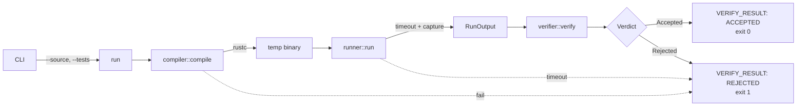

# verirust

[](https://github.com/Vick606/verirust/actions/workflows/ci.yml)
[](https://github.com/Vick606/verirust/releases)
[](https://www.rust-lang.org)
[](LICENSE)

**Deterministic verifier for Rust code submissions.** Compiles a source file in an isolated sandbox, runs it against expected output, and emits a machine-readable verdict: `ACCEPTED` or `REJECTED`. Nothing in between.

Built for the **RLVR** (Reinforcement Learning with Verifiable Rewards) setting — a verifier that accepts reasonable valid solutions and rejects everything else.

## Quick start

```bash
cargo install --git https://github.com/Vick606/verirust
verirust --source solution.rs --tests expected.txt
```

Optional flag: `--timeout <SECONDS>` (default `5`).

## Verdict contract

| Condition | stdout | stderr | exit |
|---|---|---|---|
| Accepted | `VERIFY_RESULT: ACCEPTED` | — | `0` |
| Rejected | `VERIFY_RESULT: REJECTED` | reason | `1` |
| Verifier could not run | — | `verirust: <error>` | `2` |

Rejections include compile failures, timeouts, non-zero exits, and stdout mismatches. Exit `2` means the verifier itself failed — not a rejection.

Downstream systems key on `VERIFY_RESULT:` in stdout. Reasons go to stderr, so piping stdout yields exactly one greppable line.

<details>
<summary>Example: rejected submission (compile failure)</summary>

```
$ verirust --source broken.rs --tests expected.txt
compilation failed:
error: expected one of `!`, `.`, `::`, `;`, `?`, `{`, `}`, or an operator, found `is`
 --> broken.rs:2:10
  |
2 |     this is not valid rust
  |          ^^ expected one of 8 possible tokens

VERIFY_RESULT: REJECTED
```

</details>

## Architecture



Each module owns one stage:

| Module | Responsibility |
|---|---|
| `compiler` | Invokes `rustc`, owns the temp directory via `TempDir` |
| `runner` | Spawns the binary, enforces timeout by polling `try_wait` |
| `verifier` | Compares output, produces `Verdict` |
| `run` | Orchestrates, converts compile and timeout failures into rejections |

## Limitations

- **stdout compare only** — stderr is captured but never compared. Solutions that differ only in stderr are treated as identical.
- **Single test case per invocation** — the `--tests` file is one expected output, not a set.
- **Pipe-buffer deadlock** — if a child writes more than the OS pipe buffer (~64 KiB on Linux) before exiting, it blocks on write and we time out. Fine for realistic test cases; not suitable for programs emitting large output.
- **Trailing-newline tolerance only** — whitespace elsewhere must match exactly.
- **No resource limits** beyond wall-clock timeout — no memory cap, no CPU cap, no filesystem sandbox. The compiled binary runs with the verifier's privileges.
- **rustc defaults to edition 2024** — sources written for other editions may not compile.

## Development

```bash
cargo build --release                              # optimized binary
cargo test                                         # unit + integration tests
cargo clippy --all-targets -- -D warnings          # lint, deny warnings
cargo fmt --check                                  # verify formatting
```

Requires Rust 1.85+ (edition 2024). CI runs on stable Linux.

## License

MIT — see [LICENSE](LICENSE).

---

<p align="center">
  Built with ☕ and 🦀 by <a href="https://github.com/Vick606">Victor K</a> · © 2026
</p>